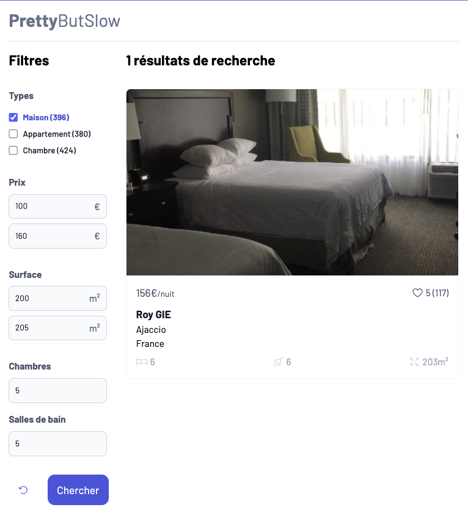

# TP Optimisation des Performances Backend

Compétences mobilisées :
- Optimisations SQL (nombre de requêtes, structuration des tables, ...)
- Mise en place de systèmes de caches variés
- Analyse des performances avec Timing API
- Analyse des performances avec APM NewRelic
- Configuration NGINX
- Optimisation du code PHP

Vous allez travailler sur une application de moteur de recherche d'hôtel (un peu à la AirBnB mais en moins bien). La version dont vous disposez est largement sous-optimisée, pour ne pas dire catastrophique. Tout au long du TP, vous allez travailler pour améliorer les performances de cette dernière.

### Mise en route du TP & Explications
[Voir les instructions](/docs/setup.md)

### ⚠️ ATTENTION ⚠️
Pour chaque question numérotée, vous devrez effectuer un commit pour que je puisse évaluer votre travail.

Vous créerez également un fichier "TP.md" qui vous servira de compte rendu où vous noterez certaines réponses aux questions et que vous versionnerez sur Git.

L'application étant très lente au début, vous êtes autorisé à ajouter `LIMIT 10` à la fin de la requête au début de `App\Services\Hotel\UnoptimizedHotelService::list()`. **Vous devrez cependant retirer cette limite lors de vos mesures pour le compte rendu**.

## Partie 1 : Faire fonctionner l'application
- Décompressez l'archive `src/assets/images.zip` pour avoir un dossier `src/assets/images`.
- Lancez Docker avec la commande `docker compose up`
- Ouvrez PHPMyAdmin sur `http://localhost:8080` et importez le fichier `./database.sql.gz` dans la base de données `tp`.
- Dans Docker Desktop, accédez au terminal du container `backend` et lancez la commande `composer install`
- Ouvrez l'application sur `http://localhost`

## Partie 2 : Mesurer les performances

1. **Installez l'extension navigateur [*Page load time*](https://chrome.google.com/webstore/detail/page-load-time/fploionmjgeclbkemipmkogoaohcdbig) et affichez-la constamment dans votre navigateur (sur Chrome cliquez sur l'icône puzzle en haut à droite et cliquez sur l'icône punaise)**. 

Vous disposez d'une classe utilitaire `src/Common/Timers.php`. Elle permet d'effectuer des mesures de performances de certaines portions de code et de les visualiser dans le navigateur.

2. **Ouvrez le fichier `src/Common/Timers.php` et observez les commentaires de documentation pour comprendre comment fonctionne cette classe. Utilisez cette classe pour mesurer les temps d'exécution de 3 méthodes qui vous semblent particulièrement consommatrices de ressources dans le service `src/Services/Hotel/UnoptimizedHotelService.php`**. **Indiquez dans votre compte rendu le nom de ces méthodes et leur temps d'exécution sur une requête**.

    
<b>ℹ️ Indice : Comment bien choisir les fonctions à analyser</b>

Il est inutile d'analyser de fonctions de haut niveau, visez des fonctions plus imbriquées. En effet, si vous mesurez des fonctions de haut niveau, elles paraîtront plus longues, car elles incluront leurs fonctions sous-jacentes. Vous serez donc biaisé en pensant que ce sont les fonctions de haut niveau qui sont à optimiser alors que ce sont les fonctions qu'elles appellent.

> Pour consulter les temps mesurés, ouvrez vos ChromeDevTools (Chrome, Brave, Edge, ...) et dans l'onglet "Network", cliquez sur le type "Doc". Cliquez sur la ligne
`localhost` (dans la colonne `name` sinon ça ne marchera pas) et dans la fenêtre qui s'affiche, consultez l'onglet "Timing", puis observez la section "Server Timing".

**
COMMIT
**

3. **Configurez l'APM NewRelic pour obtenir un monitoring plus précis**.
- Copiez le fichier `./.env-sample` en `/.env`
- Connectez-vous à [NewRelic](https://one.eu.newrelic.com/).
- Dans la barre latérale noire choisissez "*Add data*" puis "*PHP*".
- Cliquez sur "*Begin installation*" puis sélectionnez "*On host standard*"
- Dans la section "*1 Give your application a name*" saisissez `TP performances Backend`
- Dans la section "*2 Install the agent*" choisissez "*apt*" et dans le texte de l'item "*6. Configure your license key and application name*" copiez votre *license key* `sed -i -e "s/REPLACE_WITH_REAL_KEY/__LICENCE_KEY__/` (donc votre *license key* est entre les deux `/`) et saisissez-la dans l'entrée `NEW_RELIC_LICENSE_KEY` de votre `.env`.
- Dans la section "*4 Connect with your logs and infrastructure*" dans l'onglet "*Linux*" copiez la valeur de `NEW_RELIC_API_KEY` et `NEW_RELIC_ACCOUNT_ID` et reportez-les dans votre `.env`.
- **Reconstruisez le container Docker `backend` pour qu'il prenne en compte les modifications du fichier `.env` en exécutant la commande `docker compose up --build backend`**.
- Sur la page de NewRelic, Cliquez sur "*See your data*" et actualisez la page `http://localhost` pour déclencher un envoi de données.

## Partie 3 : Optimiser la base de données

4. **Tout d'abord, réduisez le nombre de connexions `PDO` dans votre application. Commencez par ajouter un timer sur la méthode `UnoptimizedHotelService::getDB()` et notez le temps qu'elle prend dans votre compte rendu. Deux de vos services les utilisent `UnoptimizedHotelService` et `RoomService`, vous allez donc créer un Singleton <u>sans utiliser le `SingletonTrait`</u> pour votre base de données et l'utiliser dans vos services deux services. Notez dans votre compte rendu par combien vous avez amélioré le temps de chargement de la page et le nouveau temps enregistré pour la méthode `UnoptimizedHotelService::getDB()`.**
  
**
COMMIT
**

5. *Lisez jusqu'au bout avant de commencer !* **Analysez le code du `UnoptimizedHotelService` et repérez certaines portions de code qui pourraient être faite en SQL**. (*3 méthodes sont concernées, mais une est différente de celles trouvées à la question 2 ! Même si elle est proche*). **Implémentez ces requêtes dans le service et contrôlez que vos filtres fonctionnent avec les valeurs de l'image ci-dessous. Vous devriez avoir le même résultat. Dans votre compte rendu, saisissez le code SQL initial et son temps d'exécution grâce à vos `Timers`, puis notez vos nouvelles requêtes et leur temps d'exécution**.

    
ℹ️ <b>Indice : Comment obtenir plusieurs valeurs des tables <code>meta</code> dans la même requête ?</b>

Vous pouvez faire des <code>INNER JOIN</code> avec alias. Par exemple :

<pre>
SELECT
    user.ID AS id,
    user.display_name AS name,
    latData.meta_value AS lat,
    lngData.meta_value AS lng
FROM
    wp_users AS USER

    -- geo lat
    INNER JOIN tp.wp_usermeta AS latData ON latData.user_id = user.ID
        AND latData.meta_key = 'geo_lat'
    -- geo lng
    INNER JOIN tp.wp_usermeta AS lngData ON lngData.user_id = user.ID
        AND lngData.meta_key = 'geo_lng'
</pre>

    
ℹ️ <b>Indice : Comment gérer l'écriture des <code>WHERE</code> en fonction des conditions de <code>$args</code> ?</b>

Vous pouvez écrire votre requête SQL dans une variable <code>$query</code> jusqu'aux instructions <code>WHERE</code>. Créez ensuite un tableau <code>$whereClauses = []</code>, qui contiendra vos conditions. Ensuite, dans vos blocs <code>if</code>, si une entrée de <code>$arg</code> vous indique qu'il faut ajouter une condition, ajoutez votre instruction SQL dans votre tableau. Ensuite, si votre tableau a au moins une entrée, faites <code>$query .= implode(' AND ', $whereClauses );</code>

Contrôle des résultats de filtre

**
COMMIT
**

6. **Inspectez la structure des tables de la base de données. Outre le fait que les types soient horribles, il n'y a surtout aucun index. Maintenant que vous avez ajouté des conditions SQL, vous devriez savoir sur quelles colonnes ajouter des indexes pour améliorer les performances. Notez dans votre compte rendu les colonnes que vous avez choisies et ainsi que le temps de chargement avant/après l'ajout de vos indexes.** 

**
COMMIT
**

7. **En analysant le code et en vous aidant des `Timers`, trouvez quelle méthode de `UnoptimizedHotelService` est appelé un grand nombre de fois (10x par hôtel affiché !). Réécrivez-la en mêlant SQL et PHP pour diviser le nombre de cette requête par 10** (*vous devrez peut-être supprimer une méthode*). **Notez dans votre compte rendu les différences de temps de chargement**.

**
COMMIT
**

8. **Si vous avez laissé vos timers de la question 2., vous devriez savoir quelles sont les 3 grosses méthodes qui sont consommatrices de ressources. Implémentez un système de cache pour réduire l'occurrence de ces calculs. Notez dans votre compte rendu l'amélioration du temps de la requête**.
- Installez la librairie [Symfony Cache](https://symfony.com/doc/current/components/cache.html) en suivant les instructions de la page. Pour avoir accès à Composer, utilisez le container Docker `backend` en allant dans l'onglet "*terminal*" de Docker Desktop sur la page du container. *Pro tips : utilisez la commande `bash` pour avoir un meilleur terminal (navigation au clavier, historique de commandes, couleurs, autocompletion, ...)*.
- Créez une classe `App\Common\Cache` en suivant l'approche Singleton et en vous basant sur le schéma UML suivant : 

La classe `TagAwareAdapterInterface` est dans le namespace `Symfony\Component\Cache\Adapter\TagAwareAdapterInterface`.
- Paramétrez un cache basé sur le système de fichiers en suivant les instructions de la page [Filesystem Cache Adapter](https://symfony.com/doc/current/components/cache/adapters/filesystem_adapter.html) et l'utilisation générale de la librairie [Symfony Cache](https://symfony.com/doc/current/components/cache.html). Votre cache devra être stocké dans le dossier `/tmp/app-cache/`.
- Utilisez maintenant votre système de cache dans votre service. **ATTENTION**, vous devez choisir avec soin quelles données seront mises en cache. Toutes ne doivent pas l'être, car elles peuvent être changées en fonction des valeurs saisies dans les filtres. Vous ne pouvez par exemple pas mettre toute la méthode `list()` en cache. Mais si vous avez bien fait votre travail à la question 2, vous savez quelles données mettre en cache. Vous devez également avoir des clés de cache uniques, tirez parti par exemple de l'ID de l'hôtel. 

**
COMMIT
**

9. **Modifiez votre système de Cache pour cette fois-ci implémentez un cache Redis. Vous trouverez la documentation nécessaire sur la page [Redis Cache Adapter](https://symfony.com/doc/current/components/cache/adapters/redis_adapter.html). Vous devriez constater une amélioration des performances de chargement comparé à la méthode basée sur les fichiers système**.
- L'hôte de la base Redis n'est pas `localhost` mais `redis` dans notre contexte Docker compose. Votre DSN devrait donc être `redis://redis`.