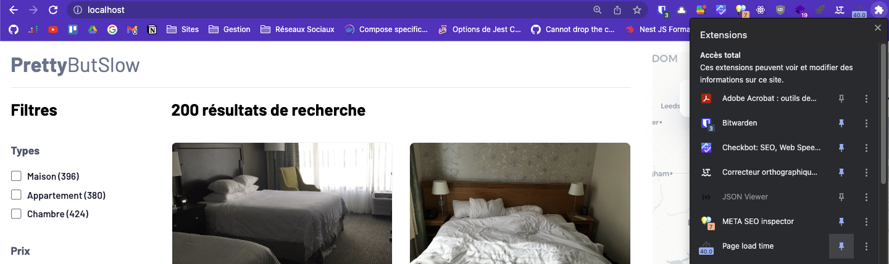
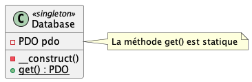
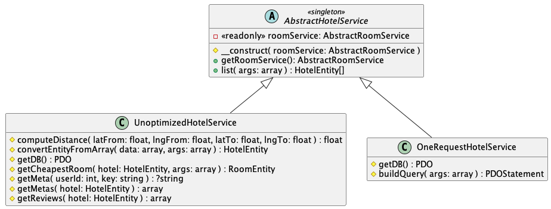
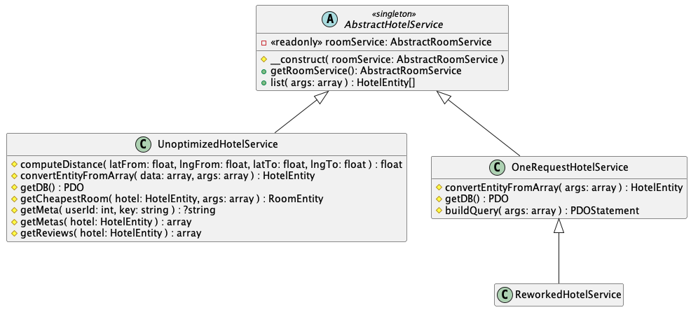
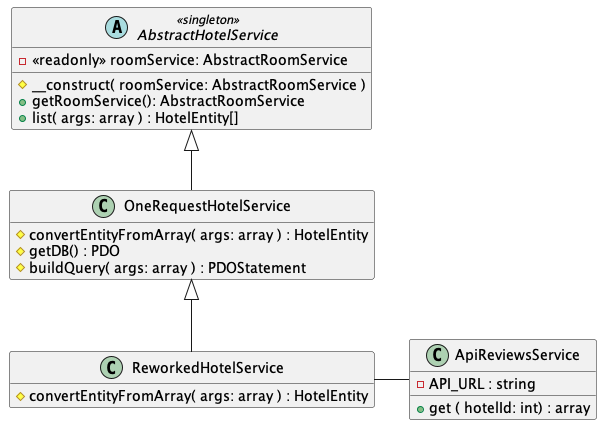
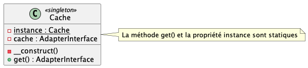
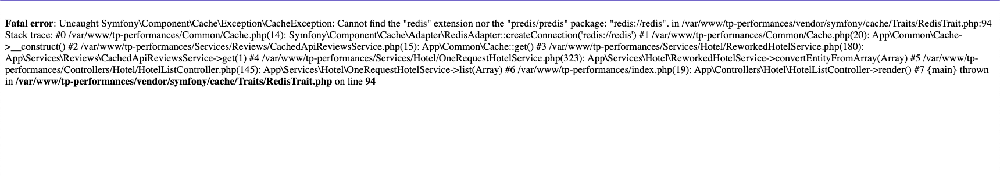
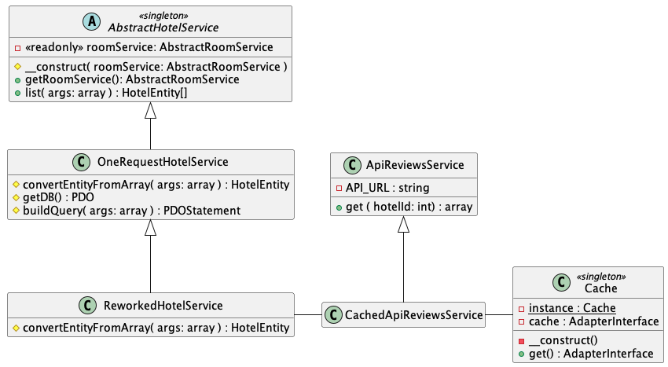

# TP Optimisation des Performances Backend

Compétences mobilisées :
- Optimisations SQL (nombre de requêtes, structuration des tables, ...)
- Mise en place de systèmes de caches variés
- Analyse des performances avec Timing API
- Analyse des performances avec APM NewRelic
- Configuration NGINX
- Optimisation du code PHP

Vous allez travailler sur une application de moteur de recherche d'hôtel (un peu à la AirBnB mais en moins bien). La version dont vous disposez est largement sous-optimisée, pour ne pas dire catastrophique. Tout au long du TP, vous allez travailler pour améliorer les performances de cette dernière.

### Mise en route du TP & Explications
[Voir les instructions](/docs/setup.md)


### ⚠️ ATTENTION ⚠️
Pour chaque question numérotée, vous devrez effectuer un commit pour que je puisse évaluer votre travail. Vous verrez des rappels ("• COMMIT •") entre les questions concernées.

Vous créerez également un fichier "TP.md" qui vous servira de compte rendu où vous noterez certaines réponses aux questions et que vous versionnerez sur Git. Les questions mentionneront explicitement quelles informations sont attendues dans ce compte rendu.

L'application étant très lente au début, vous êtes autorisé à ajouter `LIMIT 10` à la fin de la requête au début de `App\Services\Hotel\UnoptimizedHotelService::list()`. **Vous devrez cependant retirer cette limite lors de vos mesures pour le compte rendu**.

## Partie 1 : Faire fonctionner l'application
- Décompressez l'archive `src/assets/images.zip` pour avoir un dossier `src/assets/images`.
- Lancez Docker avec la commande `docker compose up`
- Ouvrez PHPMyAdmin sur `http://localhost:8080` et importez le fichier `./database.sql.gz` dans la base de données `tp`.
- Dans Docker Desktop, accédez au terminal du container `backend` et lancez la commande `composer install`
- Ouvrez l'application sur `http://localhost`

## Partie 2 : Mesurer les performances

1. **Installez l'extension navigateur [*Page load time*](https://chrome.google.com/webstore/detail/page-load-time/fploionmjgeclbkemipmkogoaohcdbig) et affichez-la constamment dans votre navigateur (sur Chrome cliquez sur l'icône puzzle en haut à droite et cliquez sur l'icône punaise)**. 

2. Vous disposez d'une classe utilitaire `src/Common/Timers.php`. Elle permet d'effectuer des mesures de performances de certaines portions de code et de les visualiser dans le navigateur.
- **Ouvrez le fichier `src/Common/Timers.php` et observez les commentaires de documentation pour comprendre comment fonctionne cette classe.**
- **Utilisez cette classe pour mesurer les temps d'exécution de 3 méthodes qui vous semblent particulièrement consommatrices de ressources dans le service `src/Services/Hotel/UnoptimizedHotelService.php`**. 
- Pour consulter les temps mesurés, ouvrez vos ChromeDevTools (Chrome, Brave, Edge, ...) et dans l'onglet "Network", cliquez sur le type "Doc". Cliquez sur la ligne
  `localhost` (dans la colonne `name` sinon ça ne marchera pas) et dans la fenêtre qui s'affiche, consultez l'onglet "Timing", puis observez la section "Server Timing".
- **Indiquez dans votre compte rendu le nom de ces méthodes et leur temps d'exécution sur une requête**.

> - [ℹ️ Indice n°1 : Comment consulter les temps de chargement mesurés par `Timers` ?](docs/indice-1.md)
> - [ℹ️ Indice n°2 : Comment bien choisir les fonctions à timer](docs/indice-2.md)

**<div style="text-align:center" align="center">• COMMIT •</div>**

## Partie 3 : Optimiser la base de données



3. **Tout d'abord, réduisez le nombre de connexions `PDO` dans votre application.**
- Commencez par **ajouter un timer sur la méthode `UnoptimizedHotelService::getDB()` et notez le temps qu'elle prend dans votre compte rendu.** Remarquez aussi son nombre d'appels : c'est autant de connexions `PDO` qui sont ouvertes !
- Deux de vos services les utilisent `UnoptimizedHotelService` et `RoomService`, **vous allez donc devoir créer un Singleton <u>sans utiliser le `SingletonTrait`</u> pour votre base de données et l'utiliser dans vos deux services.**
- **Notez dans votre compte rendu par combien vous avez amélioré le temps de chargement de la page** ainsi que **le nouveau temps enregistré pour la méthode `UnoptimizedHotelService::getDB()`.**
  
**<div style="text-align:center" align="center">• COMMIT •</div>**

4. *Lisez jusqu'au bout avant de commencer !*
- **Analysez le code du `UnoptimizedHotelService` et repérez certaines portions de code qui pourraient être faite en SQL**. (*3 méthodes sont concernées, mais une est différente de celles trouvées à la question 2 ! Même si elle est proche*). 
- N'hésitez pas à tester vos requêtes dans PHPMyAdmin avant de les mettre dans votre code PHP, vous gagnerez beaucoup de temps, sachant que la page est longue à charger !
- **Implémentez ces requêtes dans le service et contrôlez que vos filtres fonctionnent avec les valeurs de l'image contrôle (voir lien). Vous devriez avoir le même résultat après avoir saisi les mêmes valeurs de filtre :** Faites un [**🔎 Contrôle de non-régression**](docs/controle-resultats.md) (retirez bien le `LIMIT 10` !).
- **Dans votre compte rendu, saisissez le code SQL initial et son temps d'exécution grâce à vos `Timers`, puis notez vos nouvelles requêtes et leur temps d'exécution**. 

> - [ℹ️ Indice n°3 : Comment obtenir plusieurs valeurs des tables `meta` dans la même requête ?](docs/indice-3.md)
> - [ℹ️ Indice n°4 : Comment gérer l'écriture des `WHERE` en fonction des conditions de `$args` ?](docs/indice-4.md)
> - [ℹ️ Indice n°9 : Comment inspecter les requêtes qui sont effectuées sur la DB ?](docs/indice-9.md)

**<div style="text-align:center" align="center">• COMMIT •</div>**

5. En analysant le code et en vous aidant des `Timers` :
- **Trouvez quelle méthode de `UnoptimizedHotelService` est appelé un grand nombre de fois (10x par hôtel affiché !).**
- **Réécrivez-la en mêlant SQL et PHP pour diviser le nombre total de requêtes SQL par 3** (*vous devrez peut-être supprimer une méthode*).
- **Notez dans votre compte rendu le nombre de requêtes SQL avant et après votre modification, ainsi que les différences de temps de chargement**.

> **Contrôle** : Vous devriez passer de 2 201 à 601 intéractions BDD

**<div style="text-align:center" align="center">• COMMIT •</div>**



6. En exploitant le code SQL et PHP que vous avez écrit à la question 4 :
- **Dans PHPMyAdmin, concevez une requête SQL capable de requêter les hotels (avec support des filtres !) en <u>1 seule requête SQL</u>** 
- **Écrivez votre requête SQL dans votre compte rendu**
- **Créez un nouveau service `App\Services\Hotel\OneRequestHotelService` en vous basant sur le schéma UML ci-dessus qui utilisera votre superbe requête.**
- Une fois créé, **dans votre `index.php`, réassignez la valeur de `$hotelService` avec votre nouveau service**. 
- Faites un [**🔎 Contrôle de non-régression**](docs/controle-resultats.md)

> - [ℹ️ Indice n°3 : Comment obtenir plusieurs valeurs des tables `meta` dans la même requête ?](docs/indice-3.md)
> - [ℹ️ Indice n°4 : Comment gérer l'écriture des `WHERE` en fonction des conditions de `$args` ?](docs/indice-4.md)
> - [ℹ️ Indice n°5 : Utiliser des sous-requêtes dans les `INNER JOIN`](/docs/indice-5.md)
> - [ℹ️ Indice n°6 : Calculer une distance entre deux points GPS en SQL](/docs/indice-6.md)
> - [ℹ️ Indice n°9 : Comment inspecter les requêtes qui sont effectuées sur la DB ?](docs/indice-9.md)

**<div style="text-align:center" align="center">• COMMIT •</div>**

7. **Inspectez la structure des tables de la base de données.** Outre le fait que les types soient horribles, il n'y a surtout aucun index. Maintenant que vous avez ajouté des conditions SQL, vous devriez savoir sur quelles colonnes ajouter des indexes pour améliorer les performances. 
- **Notez dans votre compte rendu les colonnes que vous avez choisies pour ajouter les indexes**
- **Mesurez le temps de chargement de la page avant d'ajouter vos indexes**
- **Écrivez dans votre compte rendu la requête SQL pour ajouter vos indexes** (*Lorsque vous reprendrez le TP sur un autre poste vous serez bien content de pouvoir CTRL+C CTRL+V la création des indexes*)
- **Mesurez et consignez le nouveau temps de chargement après exécution de la requête d'ajout des indexes**.
- Dans votre `index.php`, **rebasculez sur l'ancien service `UnoptimizedHotelService` et comparez les temps de chargement de la page entre l'ancien et le nouveau service**. *Les temps devraient être très proches ! Les indexes, lorsque bien utilisés, sont très efficaces !* 

**<div style="text-align:center" align="center">• COMMIT •</div>**



8. *Le moment que vous attendiez tous* :
- En vous basant sur la structure des classes `HotelEntity` et `RoomEntity`, **créez trois nouvelles tables (`hotels`, `rooms` et `reviews`) en base données dont la structure est optimisée pour réduire le nombre de requêtes nécessaires à l'affichage des données. Portez une attention particulière aux types des données et n'oubliez pas d'ajouter les indexes.**
- **Écrivez dans votre compte rendu la requête SQL de création des tables.**
- **Remplissez les tables à partir des données obtenues par la grosse requête SQL que vous avez écrite dans la question précédente et notez dans votre compte rendu la requête SQL utilisée**.
- **Écrivez un nouveau service `App\Services\Hotel\ReworkedHotelService`** *exploitez le code PHP de construction de requête que vous avez fait dans `OneRequestService` !* 
- Faites un [**🔎 Contrôle de non-régression**](docs/controle-resultats.md) (*Attention au nombre d'avis des hôtels !*)
- **Comparez et notez dans votre compte rendu les différences de temps de chargement entre `OneRequestHotelService` et `ReworkedHotelService`.**

> - [ℹ️ Indice n°7 : Comment générer la requête SQL de création d'une table ?](docs/indice-7.md)
> - [ℹ️ Indice n°8 : Comment insérer du contenu dans une table à partir du retour d'une requête ?](docs/indice-8.md)
> - [ℹ️ Indice n°9 : Comment inspecter les requêtes qui sont effectuées sur la DB ?](docs/indice-9.md)

**<div style="text-align:center" align="center">• COMMIT •</div>**

## Partie 4 : Mise en cache

Les responsables marketing de l'entreprise vous demandent de ne plus charger les avis des hôtels depuis votre base de données actuelle. Ils souhaitent utiliser un service tiers de d'avis (comme *Avis vérifiés* ou *Trustpilot*) afin de mettre les internautes plus en confiance. Problème, ce service est gratuit et les serveurs sont de piètre qualité et lents à répondre, mais vous n'avez pas d'autre choix que d'utiliser ce service sur lequel **vous n'avez aucun contrôle sur le code**.



9. **Créez un service `App\Services\Reviews\APIReviewsService` en vous basant sur le schéma UML ci-dessus. Au sein de ce dernier, vous effectuerez des requêtes HTTP depuis PHP pour charger les avis de vos hôtels via l'API mise à disposition par le service *CheapTrustedReviews*. Vous utiliserez ensuite ce service dans votre service d'hôtel. Notez dans votre compte rendu les différences de temps de chargement qu'entraînent l'utilisation de cette API.**
- *Si j'étais vous, je surchargerais `RewordkedHotelService::convertEntityFromArray()` pour changer juste les deux valeurs des commentaires avec un appel de `ApiReviewsService::get()`.*
- Bien évidemment, *CheapTrustedReviews* n'existe pas IRL (du moins je l'espère), mais vous pouvez y accédez <u>depuis l'intérieur d'un container Docker du TP</u> à l'url `http://cheap-trusted-reviews.fake/`. Si vous voulez faire des tests, vous pouvez y accéder sur `http://localhost:8888`.
- Pour récupérer un avis d'hôtel, utilisez l'URL `http://cheap-trusted-reviews.fake/?hotel_id={hotelId}` qui vous retournera pour un hôtel donné un objet JSON comme ceci : 
```json
{
  "hotel_id": 1,
  "data": {
    "rating": 117,
    "count": 4.504273504273504
  }
}
```
**<div style="text-align:center" align="center">• COMMIT •</div>**


10. Même si vous n'avez aucun contrôle sur les performances de *http://cheap-trusted-reviews.fake*, vous pouvez **mettre en cache ses réponses pour mitiger l'impact de ce service sur votre application**
- **Installez la librairie [Symfony Cache](https://symfony.com/doc/current/components/cache.html)** en suivant les instructions de la page. 
- Pour avoir accès à Composer, utilisez le container Docker `backend` en allant dans l'onglet "*terminal*" de Docker Desktop sur la page du container. *Pro tips : utilisez la commande `bash` pour avoir un meilleur terminal (navigation au clavier, historique de commandes, couleurs, autocompletion, ...)*.
- Créez une classe `App\Common\Cache` en suivant l'approche Singleton et en vous basant sur le schéma UML ci-dessus. (*La classe `AdapterInterface` est dans le namespace `Symfony\Component\Cache\Adapter`*).
- **Paramétrez un cache basé sur Redis. Vous trouverez la documentation nécessaire sur la page [Redis Cache Adapter](https://symfony.com/doc/current/components/cache/adapters/redis_adapter.html)**. L'hôte de la base Redis n'est pas `localhost` mais `redis` dans notre contexte Docker compose. Votre DSN devrait donc être `redis://redis`.
- **Testez votre `Cache` en exécutant par l'instruction ci-dessous.** Une erreur devrait apparaître.
```php
// index.php
Cache::get()->getItem('any_item'); // TODO à retirer après avoir testé !
```
- Cette erreur se produit, car l'extension Redis n'est pas activée sur PHP.


  **<div style="text-align:center" align="center">• COMMIT •</div>**


11. **Activez l'extension Redis pour PHP**
- **Créez un fichier `src/info.php` qui contiendra le code suivant :**
```php
<?php info();
```
- **Rendez-vous sur [`http://localhost/info.php`](http://localhost/info.php)** et **cherchez "*redis*"** (*CTRL+F !*).
- Après avoir constaté l'absence de résultats, **ouvrez le fichier `docker/php.ini` et activez-y l'extension `redis.so`**
- **Actualisez `info.php` et contrôlez que Redis est bien activé**
- **Retournez sur [`http://localhost`](`http://localhost`) pour vous assurer que le cache fonctionne**.

> [ℹ️ Indice n°10 : Comment activer une extension PHP ?](docs/indice-10.md)

**<div style="text-align:center" align="center">• COMMIT •</div>**


12. **Créez un service `CachedApiReviewsService` qui hérite de `ApiReviewsService` et surchargez la méthode `get()` pour quelle utilise votre `Cache`.** Pour cela, basez-vous sur la documentation de [Symfony Cache](https://symfony.com/doc/current/components/cache.html).

**<div style="text-align:center" align="center">• COMMIT •</div>**

13. En modifiant votre `Cache`, ajoutez deux fonctionnalités :
- **Lorsqu'on ajoute dans l'URL un paramètre `skip_cache`, alors on désactive le cache pour tout le site**
- **Lorsqu'on ajoute dans l'URL un paramètre `clear_cache`, alors on supprime toutes les données mises en cache**
- **Notez dans votre compte rendu les différences de temps de chargement avec et sans cache**.

> [ℹ️ Indice n°11 : Comment désactiver le Cache Symfony ?](docs/indice-11.md)


**<div style="text-align:center" align="center">• COMMIT •</div>**

## Partie 5 : Optimisations NGINX 

Lorsque vous ouvrez le panneau *network* de vos ChromeDevTools, vous remarquerez que le poids total de la page est d'environ 26Mo. C'est parce qu'aucune compression n'est activée sur le serveur ! Par exemple, si vous cochez *JS*, vous verrez que le fichier le plus lourd est `lodash.js` avec 544Ko (1/2 Mo tout de même) !
- Pour les questions suivantes, vous devrez utiliser les fichiers `.conf` situés dans le dossier `docker/nginx`.
- Pour chaque opération effectuée sur les fichiers `docker/nginx/*.conf`, vous devrez **recharger NGINX pour que les changements soient pris en compte**. Pour cela, connectez-vous au terminal container Docker `backend` et utilisez la commande `nginx -s reload`.

14. **Paramétrez une compression GZIP pour vos transmissions client/serveur. Dans votre compte rendu, vous noterez le poids du `lodash.js` avant et après activation de la compression GZIP**
    **<div style="text-align:center" align="center">• COMMIT •</div>**
15. **Ajoutez maintenant une compression Brotli. Dans votre compte rendu, comparez le poids du fichier `lodash.js` en GZIP puis en Brotli.**
    **<div style="text-align:center" align="center">• COMMIT •</div>**
16. Paramétrez un cache HTTP pour les ressources statiques (images, CSS, JS, ...)
17. Effectuez une modification CSS et constatez que vous ne vous ne l'avez plus dans le navigateur. Ajoutez une constante de version d'application que vous ajouterez à la fin des URL d'appels de vos fichiers statiques
18. Paramétrez un cache Proxy, comparez les temps de performance. 

## Partie 6 : Bonus

19. Ajoutez le paramètre lazy-loading sur vos images 