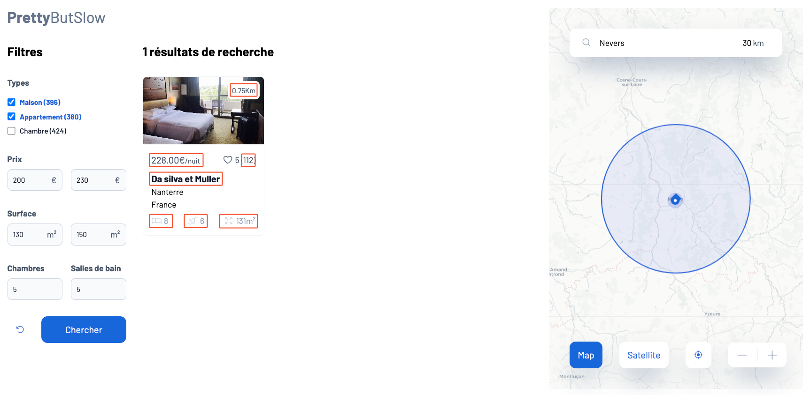

## 🔎 Contrôle de non-régression
Au cours du TP, vous serez amenés à modifier et changer plusieurs fois de services. Contrôlez vos résultats de recherche en vous assurant que l'URL suivante affiche bien les mêmes valeurs que sur la capture d'écran ci-dessous.

⚠️ **RETIREZ LE `LIMIT 10` SI VOUS L'AVEZ MIS** ⚠️

[Ouverture de localhost pour contrôle](http://localhost/?types%5B%5D=Maison&types%5B%5D=Appartement&price%5Bmin%5D=200&price%5Bmax%5D=230&surface%5Bmin%5D=130&surface%5Bmax%5D=150&rooms=5&bathRooms=5&lat=46.988708&lng=3.160778&search=Nevers&distance=30) (voir URL brute en bas de page)



```
http://localhost/?types%5B%5D=Maison&types%5B%5D=Appartement&price%5Bmin%5D=200&price%5Bmax%5D=230&surface%5Bmin%5D=130&surface%5Bmax%5D=150&rooms=5&bathRooms=5&lat=46.988708&lng=3.160778&search=Nevers&distance=30
```