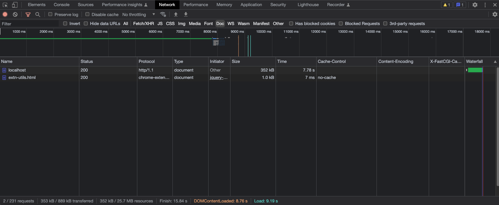

### ℹ️ Indice n°12 : Inspecter plus de données dans le panneau network

Dans vos dev tools, vous pouvez ajouter de nouvelles colonnes :
1. Faites un **click droit sur l'entête d'une des colonnes du tableau**
2. Cochez `Size` pour **contrôler le poids d'une ressource**.
   - Si la valeur est à `(disk cache)`, alors la ressource a été **chargée depuis le cache navigateur pour cette requête**.
   - Si vous laissez votre curseur sur la taille, vous verrez la différence entre le poids compressé et décompressé de la ressource. Ce qui a été transféré était compressé, la taille effective de la ressource correspond à celle du fichier décompressé
3. Cochez `Time` pour **consulter le temps de chargement d'une ressource**. Particulièrement utile pour Document, car il ne prend pas en compte le temps de chargement du CSS, JS, Images et autres fichiers statiques.
4. Cochez `Response Headers > Cache-Control` pour **savoir si une ressource utilise le cache HTTP**
5. Cochez `Response Headers > Content-Encoding` pour **vérifier si une ressource est compressée ou non**. Vous y verrez par exemple la valeur `gzip` pour une compression GZIP.
6. Allez dans `Response Headers > Manage Headers Columns...` pour ajouter un Header personnalisé tel que `X-FastCGI-Cache` pour **inspecter l'utilisation du cache FastCGI par exemple**.