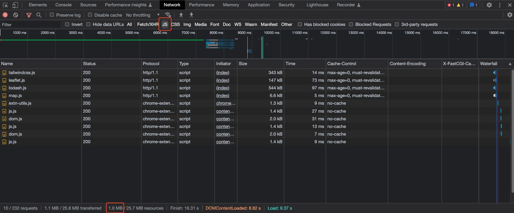

### ℹ️ Indice n°14 : Comment voir le poids total d'un type de fichiers ?

1. Ouvrez vos *ChromeDevTools*
2. Allez dans le panneau *Network*
3. Tout en bas vous verrez plusieurs indicateurs comme le nombre total de requêtes, le poids transféré, ...
4. Filtrez sur le type de ressource `JS` par exemple et en bas vous remarquerez que les indicateurs se mettent à jour en fonction de vos filtres. Par exemple, sur la capture, mes fichiers JavaScript représentent 1,0Mo sur un total de 25,7Mo pour toute la page (surtout les images !)