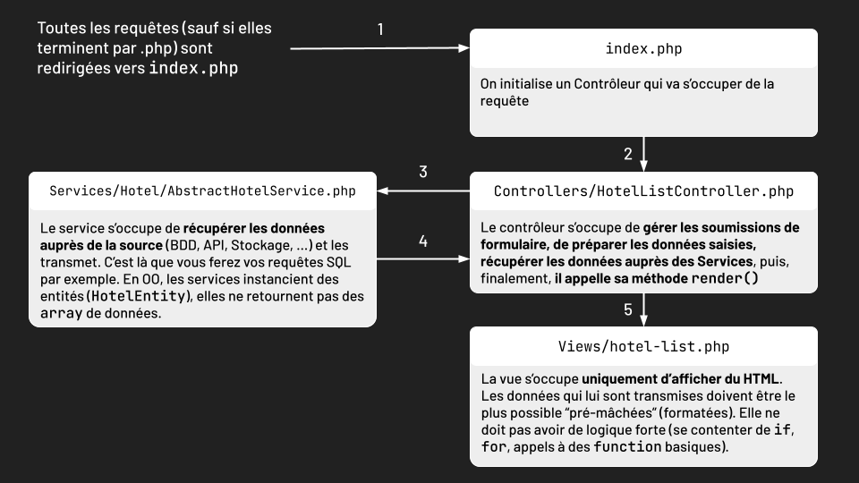
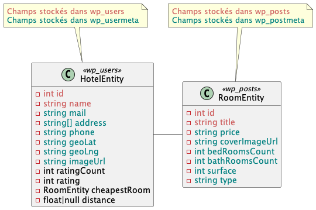

# Mise en route du TP

### Environnement Docker
Vous disposez de 4 services :
- `backend` : un serveur PHP8.1 fonctionnant avec NGINX, c'est là que votre application PHP est hébergée. Accessible sur `http://localhost`.
- `db` : une base de données MariaDB
- `phpmyadmin` : une interface PHPMyAdmin accessible sur `http://localhost:8080`
- `redis` : un serveur avec une base de données Redis qui nous servira plus tard dans le TP.

### Structure des fichiers
- Votre application PHP se trouve dans le dossier `src/` qui est servi dans le serveur `backend`.
- Toute votre base de données `db` et `redis` sont sauvegardés dans le dossier `docker/`. **Il est déconseillé de le versionner, mais si vous changez de PC vous perdrez votre base de données**. Pour limiter la casse, vous pouvez faire des exports PHPMyAdmin et les versionner.

### Fichiers de configuration
Dans le dossier `docker/` vous trouverez, en plus des dossiers volumes de vos bases de données, des fichiers de configuration :
- `php.ini` est le fichier de configuration PHP du server `backend`. Tout changement de ce fichier ne sera pris en compte qu'après un restart du container `backend`.
- `nginx.conf` est le fichier de configuration NGINX du serveur `backend`. Tout changement ne sera pris en compte qu'après exécution de la commande `nginx -s reload` sur le serveur `backend`. Si une erreur survient, le reload ne sera pas pris en compte et un message d'erreur apparaîtra. 

### Architecture de l'application
L'application est un moteur de recherche d'hôtels sur l'ensemble de la France. 

Elle respecte une architecture MVC.
- Toutes les requêtes arrivent sur le fichier `src/index.php` qui initialize un Contrôleur.
- Le Contrôleur se charge (`src/Controllers`) :
  - D'analyser le contenu du formulaire et d'en nettoyer les données
  - D'agréger les données des différents services qui récupèrent les entités dans diverses sources de stockage (`src/Services`)
  - De donner les données préformatées à la vue (`src/Views`) qui les affiche.

La base de données s'inspire fortement de celle de WordPress qui, du fait de sa forte généricité, est peu optimisée pour des usages spécifiques :
- La table `wp_users` contient les **profils des Hôtels**. Elle est associée à une table `wp_usermeta` qui se base sur un modèle clé/valeur pour stoker des données additionnelle (position géo, adresse, téléphone, ...).
- La table `wp_posts` contient quant à elle les **chambres, avis, commandes, posts de blog, pages**. Elle est associée à une table `wp_postmeta` basée sur une logique clé/valeur. On y trouvera par exemple la note des avis, le prix des chambres, leur surface, ...
- Les avis (`HotelEntity.rating` et `HotelEntity.ratingCount`) sont stockés dans `wp_posts` avec un `post_type` sur `review` et leur notes sont une meta `rating`. Ils sont liés à l'hôtel via le `post_author`.
- `HotelEntity.cheapestRoom` est la chambre la moins chère d'un hôtel et qui correspond à tous les critères saisis par l'utilisateur (nombre de salles de bains, de chambre, surface, prix et type de chambre).